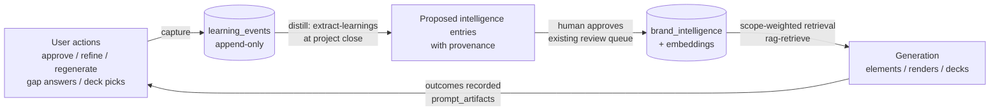

# Canopy Intelligence Layer

> How Canopy stores, retrieves, and **learns from** agency and client data — so every
> new activation starts with the context of everything that came before it.

This folder is the source of truth for the intelligence architecture. It documents
what exists today (with pointers into the code), what is planned, and the order we
intend to build it. Update these docs in the same PR as any change to the layer.

| Doc | What it covers |
|---|---|
| [`data-model.md`](./data-model.md) | Every table and JSON field in the memory substrate — existing and planned |
| [`signals.md`](./signals.md) | The user actions that generate learning signal, where they fire in code, and their capture status |
| [`roadmap.md`](./roadmap.md) | Phased build plan with active / partial / missing status |

## The thesis

Canopy's moat is compounding memory at two scopes:

- **Client memory** — Coca-Cola's third brief starts smarter than its first: locked
  brand system, approved voice, what their reviewers rejected last time.
- **Agency memory** — knowledge that crosses clients: what wins pitches, real freight
  costs per city, which materials survive the shop, playbooks.

Storage is Supabase end-to-end: **pgvector** for semantic retrieval, **JSONB** for
structured payloads. No external vector DB — it would add operational surface without
adding capability at our scale.

## The learning loop

Two hard rules:

1. **Nothing auto-extracted feeds generation unreviewed.** The approval gate
   (`brand_intelligence.is_approved`) is what keeps memory clean.
2. **Client scope is a wall.** One client's learnings must never appear in another
   client's generation context. Agency-scope entries are the only cross-client channel,
   and they must be client-agnostic by construction.
